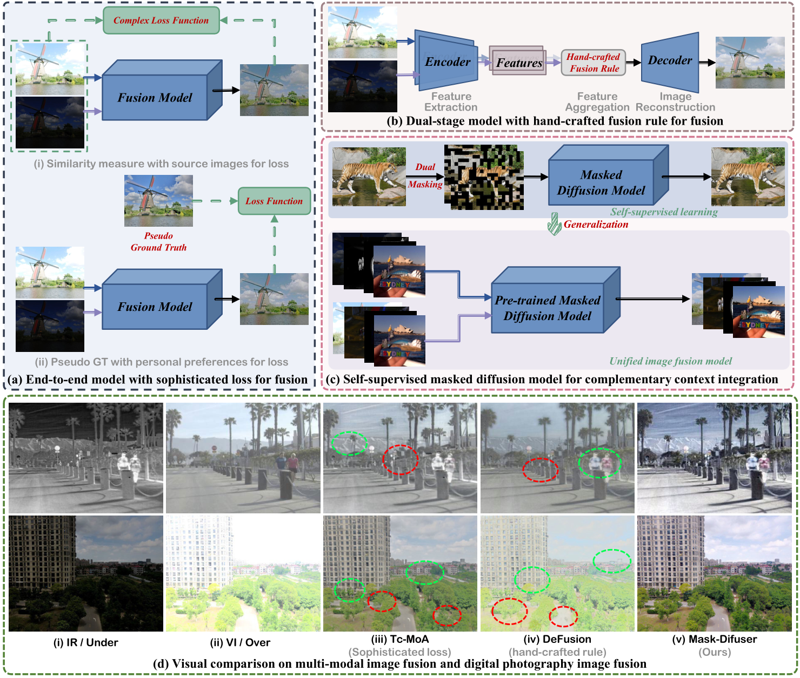
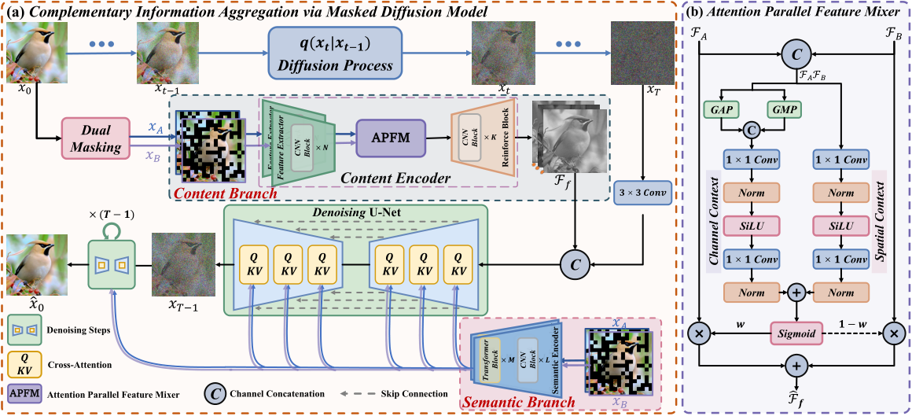
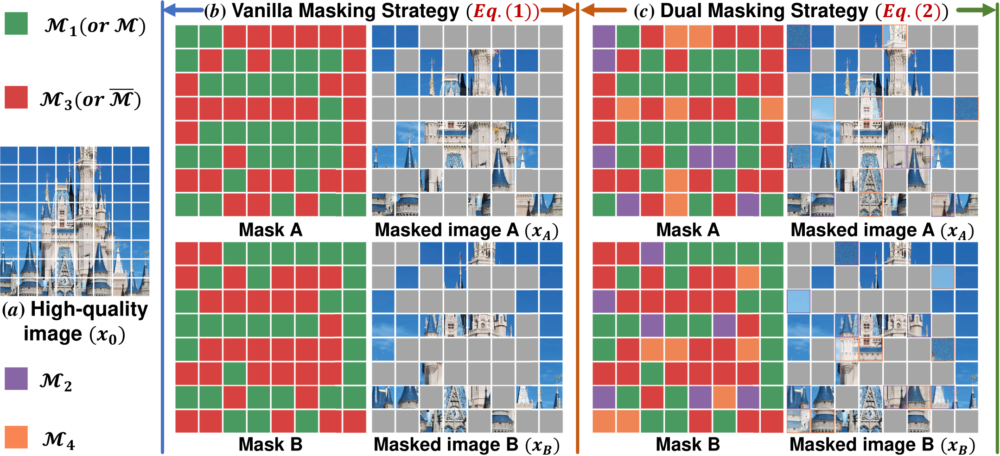
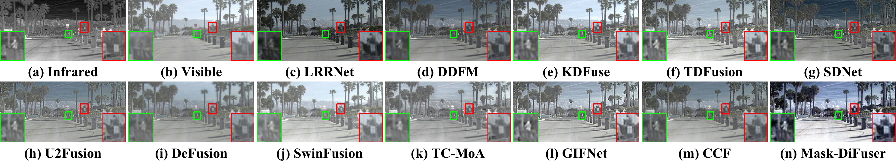
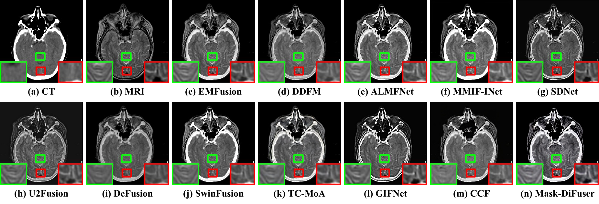
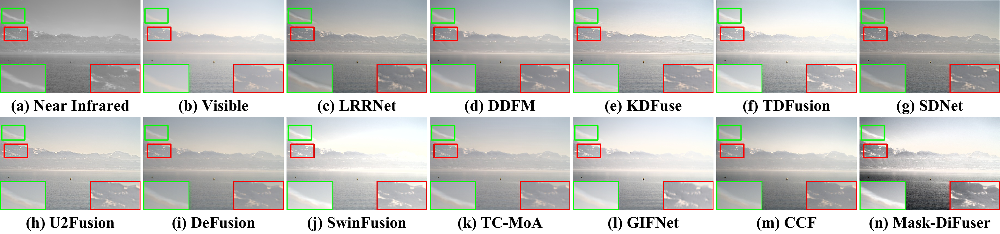
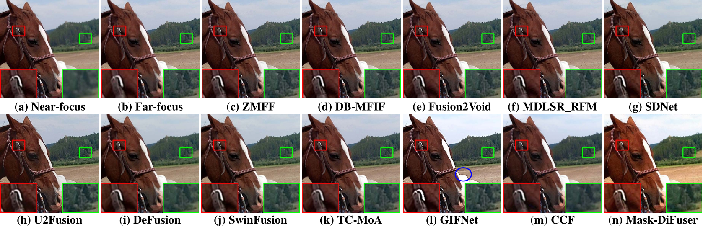
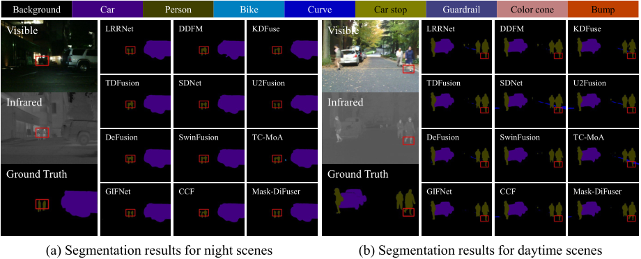

<div align="center">
    <h1>
    Mask-DiFuser: A Masked Diffusion Model for Unified Unsupervised Image Fusion
    </h1>
    <div>
        <a href='https://github.com/Linfeng-Tang' target='_blank'>Linfeng Tang<sup>1*</sup></a>,&emsp;
        <a href='https://github.com/licy2001' target='_blank'>Chunyu Li<sup>1*</sup></a>,&emsp;
        <a href='https://sites.google.com/site/jiayima2013' target='_blank'>Jiayi Ma<sup>&#8224</sup></a>
    </div>
    <div>
        <sup></sup>Wuhan University&emsp;
    </div>
    <!-- <div>
        <h4 align="center">
            <a href="https://nju-pcalab.github.io/projects/STAR" target='_blank'>
                
            </a>
            <a href="https://arxiv.org/abs/2501.02976" target='_blank'>
                
            </a>
            <a href="https://youtu.be/hx0zrql-SrU" target='_blank'>
                
            </a>
            <br>
            <a href="https://huggingface.co/spaces/SherryX/STAR" target='_blank'>
                
            </a>
            <a href="https://colab.research.google.com/drive/1K8A1U_BNpAteRhhW9A8pAYs6LWjItQs_?usp=sharing" target='_blank'>
                
            </a>
        </h4>
    </div> -->
</div>


## ✨ News:

[2025-9-10] Our paper **"Mask-DiFuser: A Masked Diffusion Model for Unified Unsupervised Image Fusion"** has been **officially accepted by IEEE Transactions on Pattern Analysis and Machine Intelligence (TPAMI)**! [[Paper Homepage](https://ieeexplore.ieee.org/document/11162636)] [[Code](https://github.com/Linfeng-Tang/Mask-DiFuser)]

## 🔎 Method Overview





## ⚙️ Installation

```
# git clone this repository
git clone https://github.com/Linfeng-Tang/Mask-DiFuser.git
cd Mask-DiFuser

# create an environment with python >= 3.8
conda create -n mask-difuser python=3.8
conda activate mask-difuser
pip install -r requirements.txt

```

## 🚀 Inference

#### Step 1: Download the pretrained model Mask-DiFuser from [Baidu Drive](https://pan.baidu.com/s/1KFr3F-pPsUB0DfK5XpjmeA?pwd=8888), and put the weight into `checkpoint/`.

#### Step 2: Running inference command
```
python test.py --pretrained_path ./checkpoint/model.pt --task_type VIF --dirA ./dataset/MSRS/ir --dirB ./dataset/MSRS/vi --output_path ./Fusion/MSRS --gpu_ids 0
```

## 🔥 Train 

#### Step1: Pretrained models and training data
We provide the [DIV2K](https://data.vision.ee.ethz.ch/cvl/DIV2K/) dataset for trainin. Please download it from the official [DIV2K Website](https://data.vision.ee.ethz.ch/cvl/DIV2K/), structured as follows:
```
/dataset/DIV2K/
        ├── train/       
        │   ├── 0001.png
        │   ├── 0002.png
        │   └── ...
        ├── val/    
        │   ├── 0001.png
        │   ├── 0002.png
        │   └── ...
```

#### Step2: Run code
```
export OMP_NUM_THREADS=1
torchrun --nproc-per-node=4 train.py --dataset_path ./dataset/DIV2K --output_path ./result --gpu_ids 0,1,2,3
```

## 📷 Results


## 🕵️‍♂️ Detection


## 🎥 Segment



## 🎓 Citations
If our work is useful for your research, please consider citing and give us a star ⭐:
```
@ARTICLE{11162636,
  author={Tang, Linfeng and Li, Chunyu and Ma, Jiayi},
  journal={IEEE Transactions on Pattern Analysis and Machine Intelligence}, 
  title={Mask-DiFuser: A Masked Diffusion Model for Unified Unsupervised Image Fusion}, 
  year={2025},
  volume={},
  number={},
  pages={1-18},
  keywords={Image fusion;Diffusion models;Feature extraction;Context modeling;Loss measurement;Semantics;Image reconstruction;Training;Visualization;Adaptation models;Image fusion;unified model;masked image modeling;diffusion model},
  doi={10.1109/TPAMI.2025.3609323}}

```

## 🤝 Contact
Please feel free to contact: `linfeng0419@gmail.com, licy0089@gmail.com`. 
We are very pleased to communicate with you and will maintain this repository during our free time.

## ❤️ Acknowledgments
Some codes are brought from [CLEDiffusion](https://github.com/YuyangYin/CLEDiffusion), [Stable-Diffusion](https://github.com/CompVis/stable-diffusion). Thanks for their excellent works.
