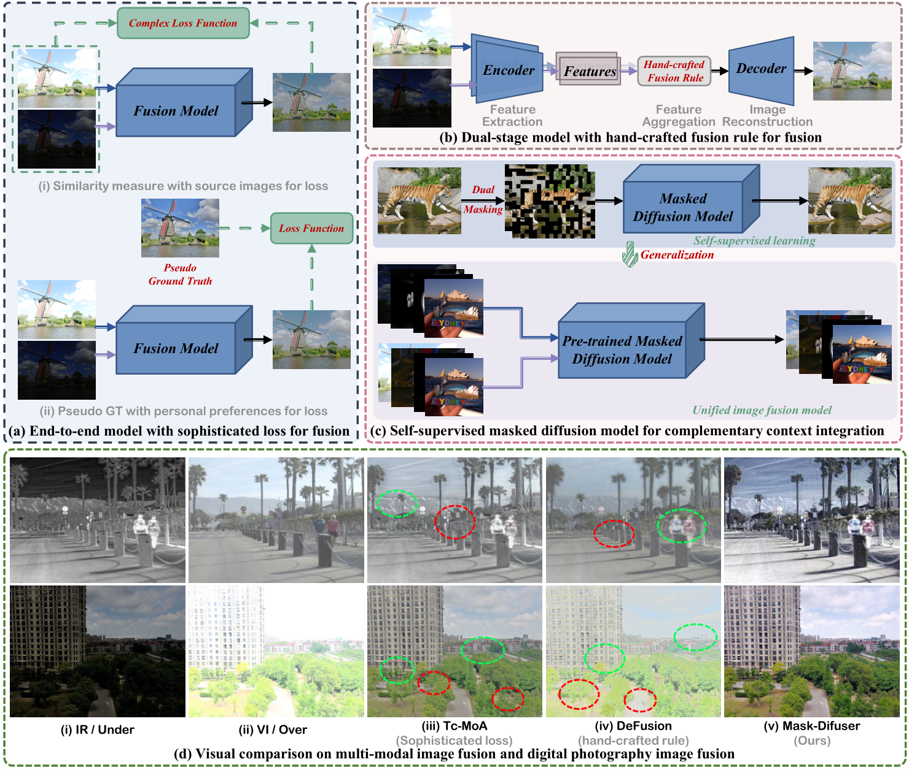
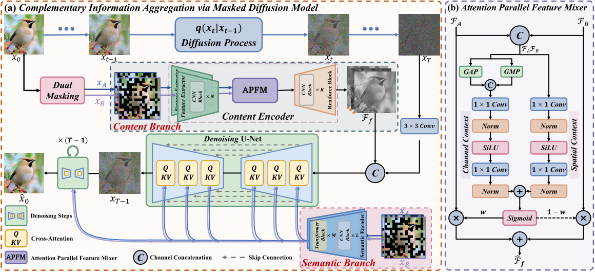
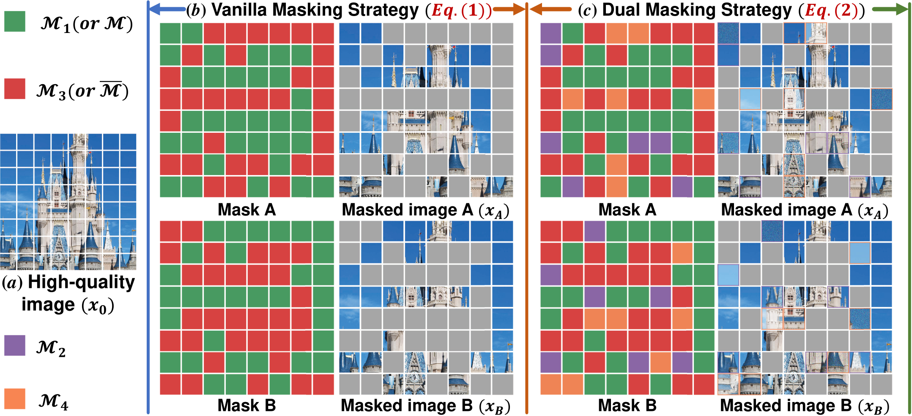
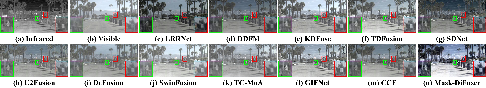
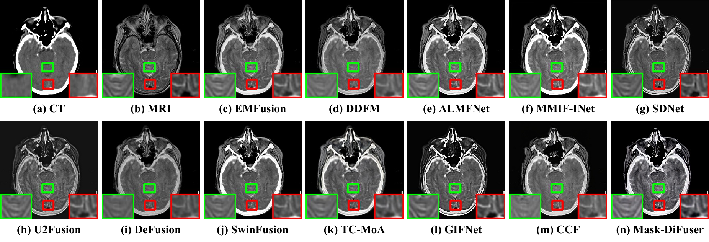
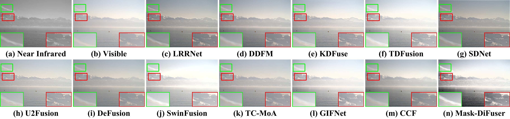
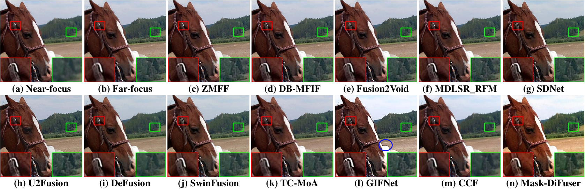
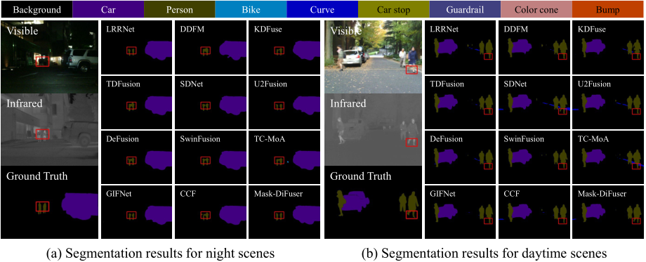

<div align="center">
    <h1>
    <a href="https://ieeexplore.ieee.org/document/11162636" target="_blank">Mask-DiFuser: A Masked Diffusion Model for Unified Unsupervised Image Fusion</a>
    </h1>

<p align="center">
  <a href="https://esi.help.clarivate.com/Content/overview.htm"></a>
  <a href="https://scholar.google.com/citations?user=PyRqpAsAAAAJ&hl=en"></a>
</p>
<p align="center"><sub>Google Scholar citation count updated July 18, 2026.</sub></p>

    <div>
        <a href='https://github.com/Linfeng-Tang' target='_blank'>Linfeng Tang<sup>1*</sup></a>,&emsp;
        <a href='https://github.com/licy2001' target='_blank'>Chunyu Li<sup>1*</sup></a>,&emsp;
        <a href='https://sites.google.com/site/jiayima2013' target='_blank'>Jiayi Ma<sup>&#8224</sup></a>
    </div>
    <div>
        <sup></sup>Wuhan University&emsp; <br>
        <sup>*</sup>Equal Contribution &emsp; <sup>&#8224;</sup>Corresponding Author
    </div>
    <br>
    <!-- <div style="text-decoration: none !important;">
        <a href="https://github.com/Linfeng-Tang/Mask-DiFuser" target='_blank' style="text-decoration: none !important; border: none !important;">
            
        </a>
       <a href="https://ieeexplore.ieee.org/abstract/document/11162636" target='_blank' style="text-decoration: none !important; border: none !important;">Paper</a>
    </div> -->
</div>
    </div>
    <!-- <div>
        <h4 align="center">
            <a href="https://nju-pcalab.github.io/projects/STAR" target='_blank'>
                
            </a>
            <a href="https://arxiv.org/abs/2501.02976" target='_blank'>
                
            </a>
            <a href="https://youtu.be/hx0zrql-SrU" target='_blank'>
                
            </a>
            <br>
            <a href="https://huggingface.co/spaces/SherryX/STAR" target='_blank'>
                
            </a>
            <a href="https://colab.research.google.com/drive/1K8A1U_BNpAteRhhW9A8pAYs6LWjItQs_?usp=sharing" target='_blank'>
                
            </a>
        </h4>
    </div> -->
</div>


## ✨ News:
- **[2026-06-02]** Our paper *[DSPFusion: Image Fusion via Degradation and Semantic Dual-Prior Guidance](https://doi.org/10.1109/TIP.2026.3700938)* has been officially accepted by **IEEE Transactions on Image Processing (IEEE TIP)**! [[Paper](https://doi.org/10.1109/TIP.2026.3700938)] [[arXiv](https://arxiv.org/abs/2503.23355)] [[Code](https://github.com/Linfeng-Tang/DSPFusion)]
- **[2026-02-21]** Our paper *[VideoFusion: A Spatio-Temporal Collaborative Network for Multi-modal Video Fusion](https://openaccess.thecvf.com/content/CVPR2026/html/Tang_VideoFusion_A_Spatio-Temporal_Collaborative_Network_for_Multi-modal_Video_Fusion_CVPR_2026_paper.html)* has been officially accepted by **The IEEE/CVF Conference on Computer Vision and Pattern Recognition (CVPR 2026)**! [[Paper](https://openaccess.thecvf.com/content/CVPR2026/html/Tang_VideoFusion_A_Spatio-Temporal_Collaborative_Network_for_Multi-modal_Video_Fusion_CVPR_2026_paper.html)] [[arXiv](https://arxiv.org/abs/2503.23359)] [[Code](https://github.com/Linfeng-Tang/VideoFusion)]
- **[2025-09-18]** Our paper *[ControlFusion: A Controllable Image Fusion Framework with Language-Vision Degradation Prompts](https://arxiv.org/pdf/2503.23356?)* has been officially accepted by **Advances in Neural Information Processing Systems (NeurIPS 2025)**! [[Paper](https://arxiv.org/pdf/2503.23356?)] [[Code](https://github.com/Linfeng-Tang/ControlFusion)]  

- **[2025-09-10]** Our paper *[Mask-DiFuser: A Masked Diffusion Model for Unified Unsupervised Image Fusion](https://ieeexplore.ieee.org/document/11162636)* has been officially accepted by **IEEE Transactions on Pattern Analysis and Machine Intelligence (IEEE TPAMI)**! [[Paper](https://ieeexplore.ieee.org/document/11162636)] [[Code](https://github.com/Linfeng-Tang/Mask-DiFuser)]  

- **[2025-03-15]** Our paper *[C2RF: Bridging Multi-modal Image Registration and Fusion via Commonality Mining and Contrastive Learning](https://github.com/Linfeng-Tang/C2RF)* has been officially accepted by the **International Journal of Computer Vision (IJCV)**! [[Paper](https://link.springer.com/article/10.1007/s11263-025-02427-1)] [[Code](https://github.com/Linfeng-Tang/C2RF)]  

- **[2025-02-11]** We released a large-scale dataset for infrared and visible video fusion: *[M3SVD: Multi-Modal Multi-Scene Video Dataset](https://github.com/Linfeng-Tang/M3SVD)*.  


## 🔎 Method Overview
### Various Scheme Comparison


### Framework


### Vanilla masking scheme vs. our dual masking scheme.



## ⚙️ Installation

```
# git clone this repository
git clone https://github.com/Linfeng-Tang/Mask-DiFuser.git
cd Mask-DiFuser

# create an environment with python >= 3.8
conda create -n mask-difuser python=3.8
conda activate mask-difuser
pip install -r requirements.txt

```

## 🚀 Inference

#### Step 1: Download the pretrained model Mask-DiFuser from [Baidu Drive](https://pan.baidu.com/s/1KFr3F-pPsUB0DfK5XpjmeA?pwd=8888) or [Google Drive](https://drive.google.com/file/d/1V_P8qgZHnXuMNvgJrnCZcbQGVAPWeKcy/view?usp=drive_link), and put the weight into `checkpoint/`.

#### Step 2: Running inference command
```
python test.py --pretrained_path ./checkpoint/model.pt --task_type VIF --dirA ./dataset/MSRS/ir --dirB ./dataset/MSRS/vi --output_path ./Fusion/MSRS --gpu_ids 0
```

## 🔥 Train 

#### Step1: Pretrained models and training data
Please download DIV2K dataset from the official [DIV2K Website](https://data.vision.ee.ethz.ch/cvl/DIV2K/), structured as follows:
```
/dataset/DIV2K/
        ├── train/       
        │   ├── 0001.png
        │   ├── 0002.png
        │   └── ...
        ├── val/    
        │   ├── 0001.png
        │   ├── 0002.png
        │   └── ...
```

#### Step2: Run code
```
export OMP_NUM_THREADS=1
torchrun --nproc-per-node=4 train.py --dataset_path ./dataset/DIV2K --output_path ./result --gpu_ids 0,1,2,3
```

## 📷 Results
### Visual comparison of infrared-visible image fusion results for night scenes on the MSRS dataset

### Visual comparison of infrared-visible image fusion results on the RoadScene dataset


### Visual comparison of multi-exposure image fusion results on the SICE dataset


### Visual comparison of multi-exposure image fusion results on the MEFB dataset


### Visual comparison of medical image fusion results on the Harvard dataset


### Visual comparison of near-infrared and visible image fusion results on the Nirscene dataset


### Visual comparison of multi-polarization fusion results on the Polarization dataset


### Visual comparison of multi-focus image fusion results on the Lytro dataset


## 🕵️‍♂️ Detection


## 🎥 Segment



## 🎓 Citations
If our work is useful for your research, please consider citing and give us a star ⭐:
```
@article{Tang2026Mask-DiFuser,
  author={Tang, Linfeng and Li, Chunyu and Ma, Jiayi},
  journal={IEEE Transactions on Pattern Analysis and Machine Intelligence}, 
  title={Mask-DiFuser: A Masked Diffusion Model for Unified Unsupervised Image Fusion}, 
  year={2026},
  volume={48},
  number={1},
  pages={591--608},
}


```

## 🤝 Contact
Please feel free to contact: `linfeng0419@gmail.com, licy0089@gmail.com`. 
We are very pleased to communicate with you and will maintain this repository during our free time.

## ❤️ Acknowledgments
Some codes are brought from [CLEDiffusion](https://github.com/YuyangYin/CLEDiffusion), [Stable-Diffusion](https://github.com/CompVis/stable-diffusion). Thanks for their excellent works.
